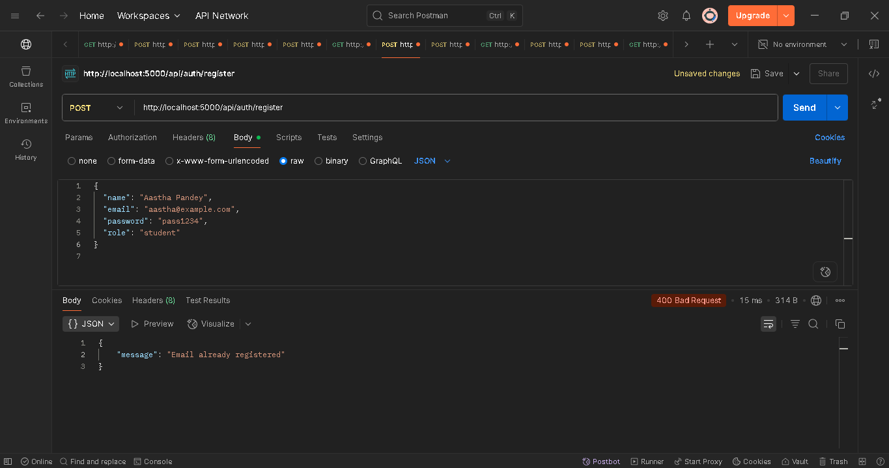
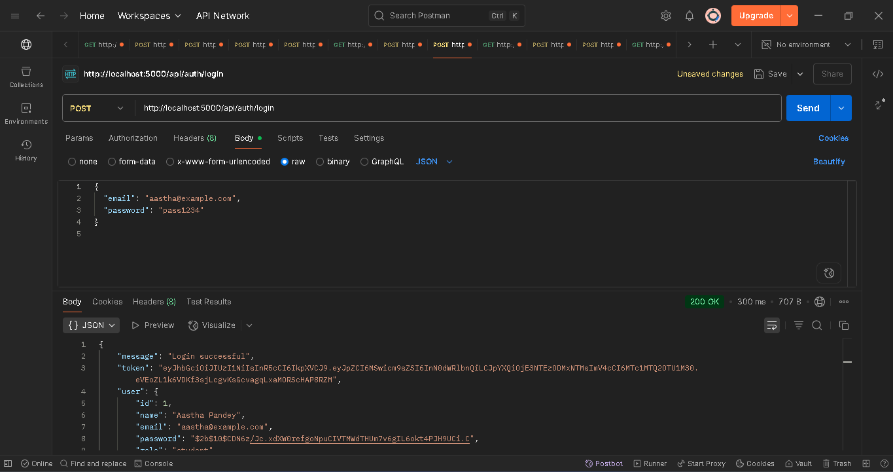
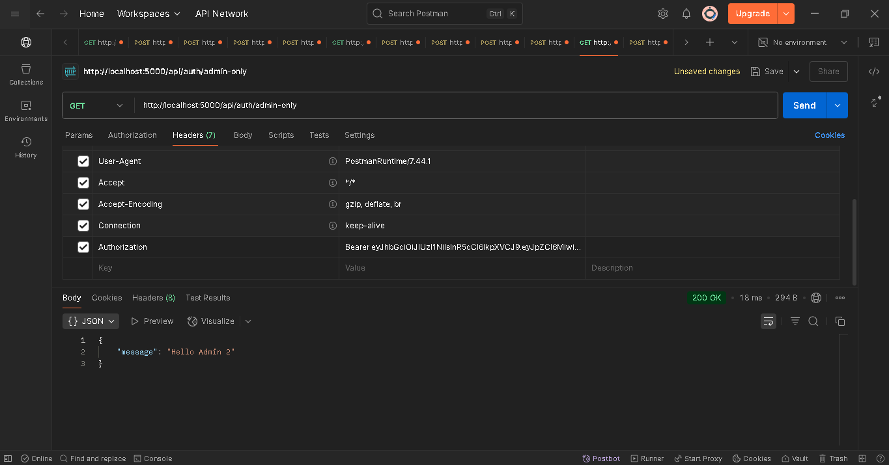
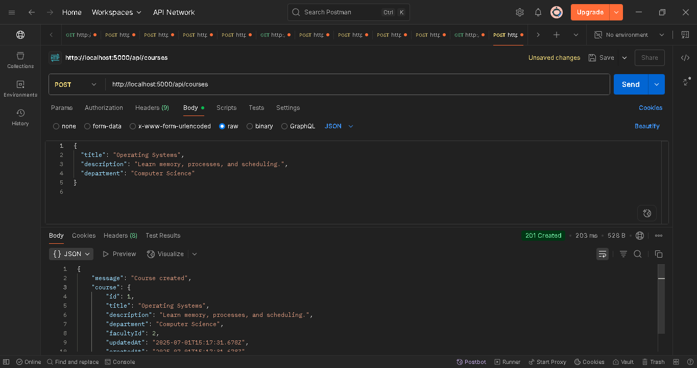
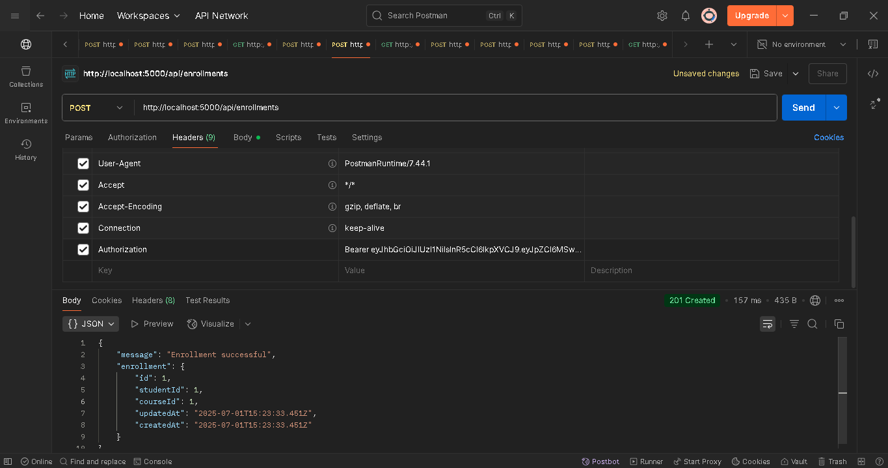
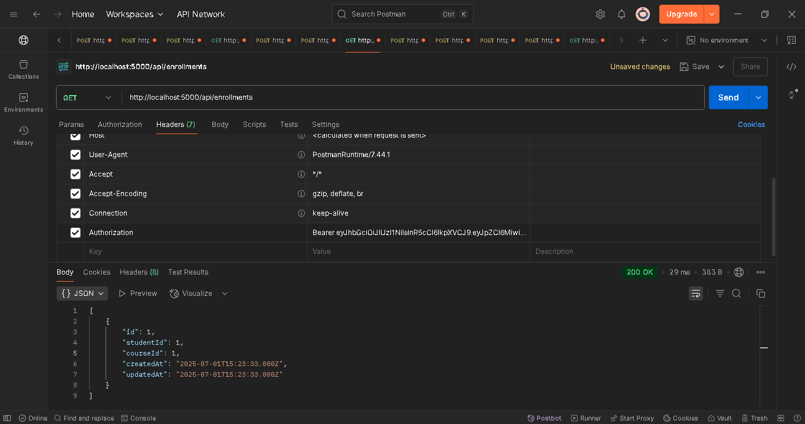
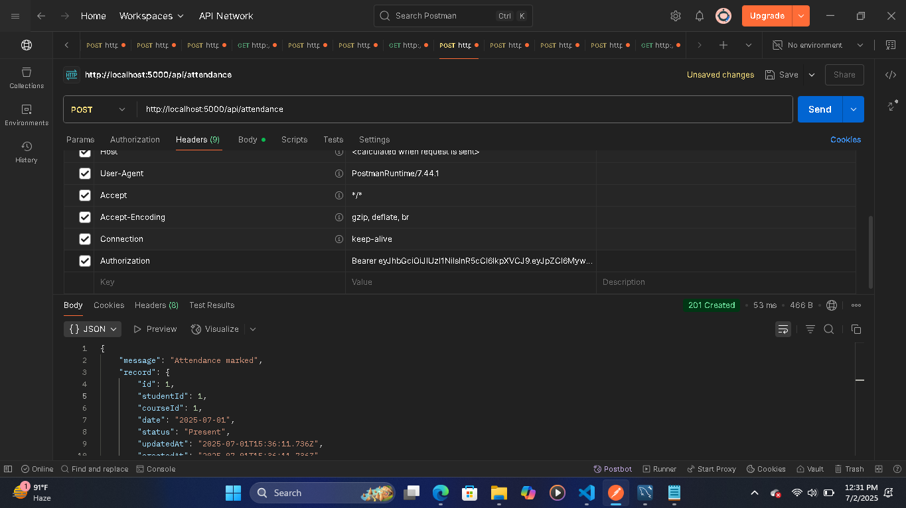
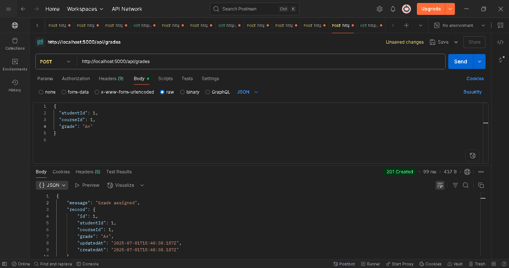
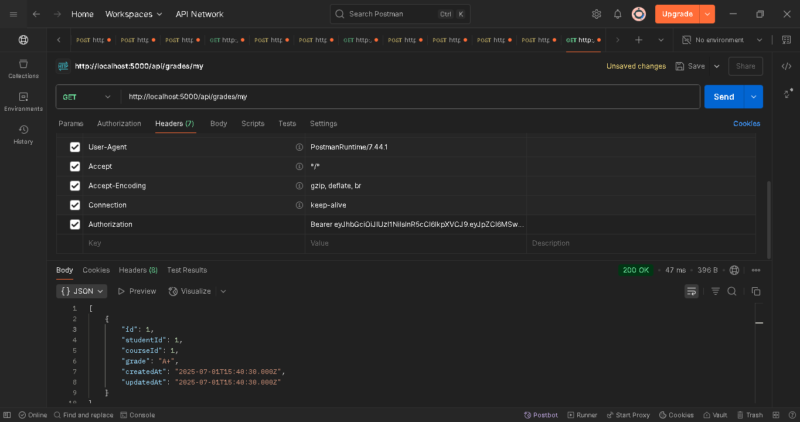

# 🎓 EduTrack – Student Management System

EduTrack is a role-based backend API system for managing students, courses, enrollments, attendance, and grades. It uses **Node.js**, **Express**, **MySQL**, and **Sequelize ORM**, and includes secure JWT-based authentication.

---

## 📚 Features

### 🔐 Authentication & Roles
- Register/Login using JWT
- Three roles: `admin`, `faculty`, `student`
- Role-based route access using middleware

### 📘 Course Management
- Admin/Faculty can create new courses
- Students can view available courses

### 👨‍🏫 Student Enrollment
- Students can enroll in courses
- Admin/Faculty can view all enrollments

### 📝 Attendance Tracking
- Faculty can mark student attendance
- Students can view their own attendance

### 🎓 Grading System
- Faculty can assign grades per course
- Students can view their own grades

---

## 🛠️ Tech Stack

- **Backend:** Node.js, Express.js
- **Database:** MySQL
- **ORM:** Sequelize
- **Authentication:** JWT
- **Tools:** Postman, VS Code

---

## 🔗 API Endpoints

### 🔐 Auth

| Method | Endpoint              | Access       | Description           |
|--------|-----------------------|--------------|-----------------------|
| POST   | /api/auth/register    | Public       | Register user         |
| POST   | /api/auth/login       | Public       | Login and get token   |
| GET    | /api/auth/admin-only  | Admin only   | Protected test route  |

### 📘 Courses

| Method | Endpoint       | Access             | Description         |
|--------|----------------|--------------------|---------------------|
| POST   | /api/courses   | Admin/Faculty only | Create course       |
| GET    | /api/courses   | All roles          | List all courses    |

### 👨‍🏫 Enrollments

| Method | Endpoint          | Access       | Description               |
|--------|-------------------|--------------|---------------------------|
| POST   | /api/enrollments  | Student only | Enroll in a course        |
| GET    | /api/enrollments  | Admin/Faculty| View all enrollments      |

### 📝 Attendance

| Method | Endpoint              | Access       | Description              |
|--------|-----------------------|--------------|--------------------------|
| POST   | /api/attendance       | Faculty only | Mark attendance          |
| GET    | /api/attendance/my    | Student only | View personal attendance |

### 🎓 Grades

| Method | Endpoint           | Access       | Description              |
|--------|--------------------|--------------|--------------------------|
| POST   | /api/grades         | Faculty only | Assign grade             |
| GET    | /api/grades/my      | Student only | View personal grades     |

---

## 🧪 API Testing

Use **Postman** to test endpoints.  
💡 **Login → Get Token → Use in Authorization (Bearer Token)**

---

## 📁 Project Setup

```bash
git clone https://github.com/aastha77/edutrack-backend.git
cd edutrack-backend
npm install


### 🔧 Setup `.env` File

Create a `.env` file in the root directory and add:


DB_NAME=edutrack
DB_USER=root
DB_PASS=your_mysql_password
DB_HOST=127.0.0.1
PORT=5000
JWT_SECRET=your_jwt_secret


### 🏃 Run the Server

node index.js
# or
npx nodemon index.js

-----


✅ Done By
Aastha Pandey
FullStack Development Internship Project – July 2025


## ✅ Export Postman Collection

In Postman:

1. Click the collection (EduTrack)
2. Click `...` → **Export**
3. Choose `Collection v2.1`
4. Save it as `EduTrack_API_Collection.json`


## ✅ Final Step: Push to GitHub

1. Open terminal in your project folder
2. Run these commands:

git init
git add .
git commit -m "EduTrack Student Management System Complete"
git remote add origin https://github.com/aastha77/edutrack-backend.git
git branch -M main
git push -u origin main


## 📸 Postman API Testing Screenshots

### 🔐 1. User Registration (Admin/Faculty/Student)  


### 🔐 2. Login with JWT Token  


### 🔒 3. Access Admin-Only Protected Route  


### 📘 4. Create Course (Admin/Faculty)  


### 🧑‍🎓 5. Student Enroll in Course  


### 📄 6. Faculty Viewing All Enrollments  


### 📝 7. Faculty Marking Attendance  


### 🎓 8. Faculty Assigning Grades  


### 📈 9. Student Viewing Grades  

